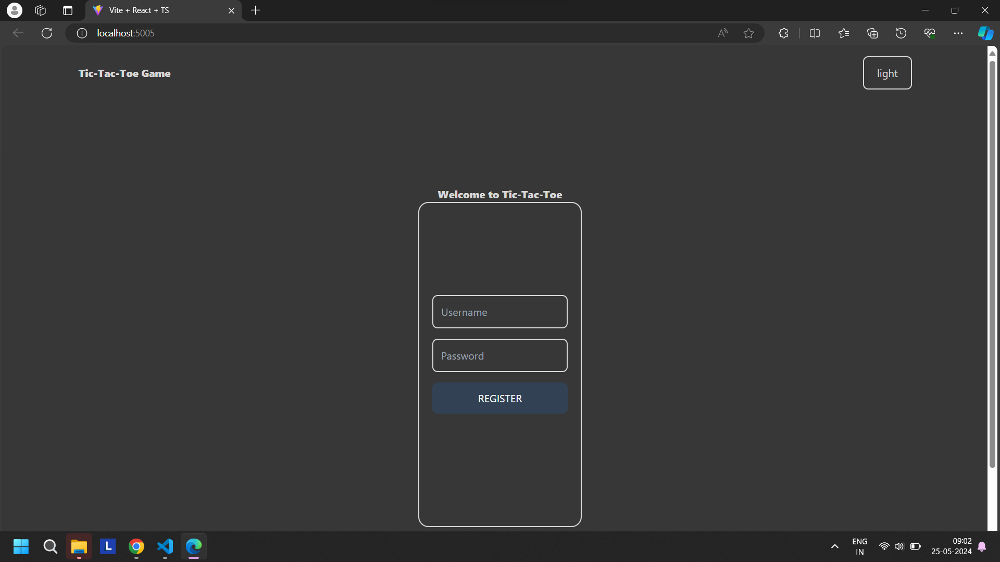
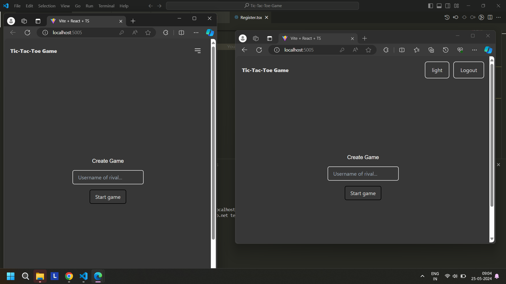
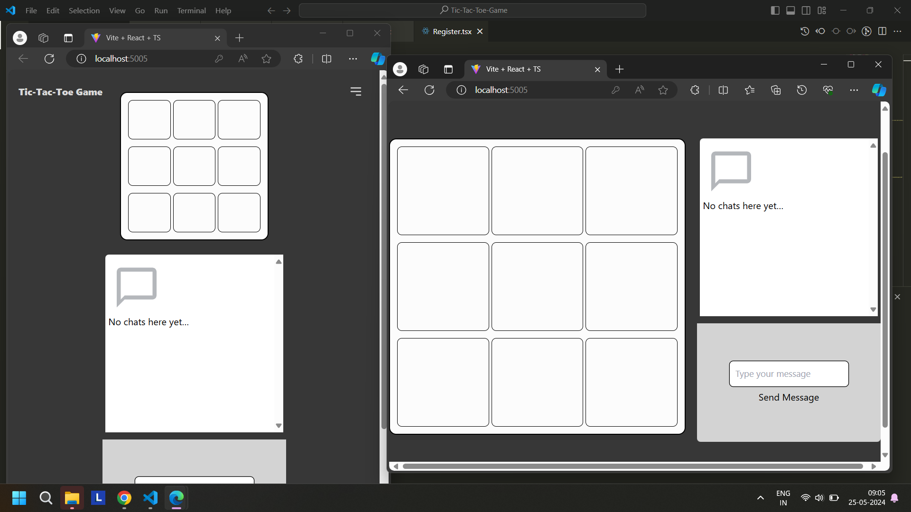

# 🎮 Real-Time Multiplayer Tic-Tac-Toe Game (MERN Stack)

A full-stack real-time multiplayer **Tic-Tac-Toe** web game powered by the **MERN stack**. It includes **real-time chat integration using Stream Chat API**, user authentication, session management, and a smooth multiplayer game experience. Deployed on **AWS EC2 using Docker**, this project showcases my ability to build scalable, interactive web applications with secure backend functionality and real-time features.

---

## 🧠 What I Built

- 👨‍💻 A real-time multiplayer game using **WebSockets** via Stream Chat
- 🔒 Secure authentication using **JWT** and sessions
- 📦 Backend APIs built with **Node.js, Express**, and **MongoDB**
- 🧑‍🎨 Interactive UI using **React.js**
- 🐳 Production-ready deployment using **Docker** on an **AWS EC2** instance

---

## 🌐 Live Demo

Hosted on AWS EC2:  
🔗 [http://13.235.79.12:5005/](http://13.235.79.12:5005/)

---

## 📸 Screenshots

### 📝 Register Page


### 🎮 Create & Join Game Page


### 🧠 Game Interface


---

## 🚀 Features

- 🔐 User registration and login with encrypted password storage
- 🧑‍🤝‍🧑 Create or join private/public games via unique room codes
- 🔄 Real-time gameplay and messaging via **Stream Chat**
- 🧠 Game logic: win-checking, draw detection, and score tracking
- 🌍 Responsive UI for both desktop and mobile
- 📦 Dockerized for consistent deployment

---

## ⚙️ Tech Stack

### 💻 Frontend:
- React.js
- Tailwind CSS (if used)

### 🖥️ Backend:
- Node.js
- Express.js
- MongoDB (via Mongoose)
- JWT & Express Session for Authentication

### 📡 Real-Time & Chat:
- Stream Chat API

### 🐳 DevOps:
- Docker
- AWS EC2
- PM2 (optional for running Node server in production)

---

## 📦 Dependencies

```json
"dependencies": {
  "bcrypt": "^5.1.1",
  "bcryptjs": "^2.4.3",
  "connect-mongo": "^5.1.0",
  "cookie-parser": "^1.4.6",
  "cors": "^2.8.5",
  "dotenv": "^16.4.5",
  "envalid": "^8.0.0",
  "express": "^4.19.2",
  "express-session": "^1.18.0",
  "http-errors": "^2.0.0",
  "jsonwebtoken": "^9.0.2",
  "mongoose": "^8.3.3",
  "morgan": "^1.10.0",
  "stream-chat": "^8.31.0",
  "uuid": "^9.0.1",
  "pnpm": "^10.7.1"
}


